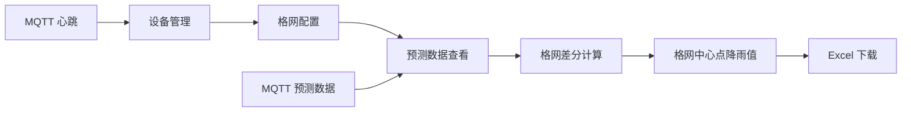

# 降雨格网系统前端

`nav-rain-grid-web` 是降雨格网系统的前端管理端，基于 Angular、NG-ALAIN 和 NG-ZORRO 构建，用于管理设备、格网配置、降雨预测数据和格网降雨结果导出流程。

系统面向降雨格网业务：后端通过 MQTT 接收设备心跳与降雨预测值，前端负责将设备、格网、预测数据和计算结果可视化，支撑“按小时进行格网差分计算，并输出 1 / 12 / 24 小时格网降雨 Excel”的业务闭环。

## 项目定位

前端核心目标是为业务人员提供一个清晰、可维护的后台管理界面：

- 查看设备在线状态、别名、经纬度和最后心跳时间
- 维护格网配置，包括设备集合、格网分辨率、最少设备数、最小设备距离等
- 查看设备上报的 1 / 12 / 24 小时降雨预测数据
- 触发或下载格网中心点降雨结果 Excel
- 观察系统运行状态和数据接入状态

## 核心业务流程



## 主要功能规划

### 工作台

用于展示系统整体运行状态：

- 在线设备数、离线设备数
- 今日预测数据量
- 启用格网数
- 最近一次格网计算时间
- 1 / 12 / 24 小时预测降雨概览

### 设备管理

对应后端 `Device` 模块。

建议页面能力：

- 设备列表
- 设备新增、编辑、删除
- 按设备号、别名、状态筛选
- 展示设备别名、设备号、经纬度、设备类型、在线状态、最后心跳时间
- 展示是否启用北斗水位计、是否启用降雨预测

后端接口：

```text
POST   /api/device
PUT    /api/device/:guid
DELETE /api/device/:guid
GET    /api/device/:guid
GET    /api/device/sncode/:sncode
GET    /api/device/list
GET    /api/device/query
```

### 格网管理

对应后端 `Grid` 模块。

建议页面能力：

- 格网列表
- 格网新增、编辑、删除
- 选择参与格网计算的设备
- 配置格网分辨率、最少设备数、最小距离
- 启用或禁用格网
- 查看格网关联设备数量和配置完整性

后端接口：

```text
POST   /api/grid
PUT    /api/grid/:guid
DELETE /api/grid/:guid
GET    /api/grid/:guid
GET    /api/grid/list
GET    /api/grid/query
```

### 预测数据

对应后端 `Predict` 模块。

建议页面能力：

- 按设备号、时间范围查询预测数据
- 展示 `1 / 12 / 24` 小时预测降雨
- 展示预测降雨等级
- 查看最新一条预测数据
- 导出预测数据 Excel

后端接口：

```text
DELETE /api/predict/params
DELETE /api/predict/:guid
GET    /api/predict/:guid
GET    /api/predict/list
GET    /api/predict/query
GET    /api/predict/last
GET    /api/predict/export
```

### 格网降雨结果

该模块围绕系统核心算法结果设计。

业务说明：

- 系统每小时读取设备降雨预测值
- 根据格网配置和设备坐标进行空间差分
- 计算每个格网中心坐标的预测降雨值
- 分别生成 `1 小时`、`12 小时`、`24 小时`格网降雨结果
- 将结果输出到 Excel

建议 Excel 字段：

| 字段 | 说明 |
| --- | --- |
| gridName | 格网名称 |
| centerLng | 格网中心经度 |
| centerLat | 格网中心纬度 |
| forecastHour | 预测时长，取值 1 / 12 / 24 |
| predictRain | 预测降雨值 |
| predictRainLevel | 预测降雨等级 |
| baseTime | 预测基准时间 |
| time | 预测时间 |

## 技术栈

- Angular 21
- NG-ALAIN
- NG-ZORRO
- DELON
- RxJS
- ECharts
- Less
- TypeScript
- Vitest
- Playwright

## 目录结构

```text
nav-rain-grid-web
├── public                 # 静态资源
├── src
│   ├── app
│   │   ├── core           # 启动、网络、拦截器等核心能力
│   │   ├── layout         # 基础布局
│   │   ├── routes         # 页面路由
│   │   └── shared         # 公共组件、管道、服务、类型
│   ├── assets             # 图片、主题和样式资源
│   ├── environments       # 环境配置
│   └── styles             # 全局样式
├── angular.json
├── package.json
├── proxy.conf.js
└── pnpm-lock.yaml
```

## 本地开发

推荐使用 `pnpm`。

```bash
pnpm install
pnpm start
```

默认启动 Angular 开发服务，并自动打开浏览器。

如果需要指定代理访问本地后端，可按实际后端端口调整 [proxy.conf.js](/Users/wfu/Documents/works/navfirst/code/nav-rain/nav-rain-grid-web/proxy.conf.js:1)。

当前前端环境配置：

```ts
api: {
  baseUrl: '/api',
  refreshTokenEnabled: false,
  refreshTokenType: 'auth-refresh'
}
```

对应后端默认地址：

```text
http://127.0.0.1:18889/api
```

## 常用命令

```bash
pnpm start
```

启动开发环境。

```bash
pnpm build
```

构建生产版本。

```bash
pnpm test
```

运行测试。

```bash
pnpm lint
```

运行 TypeScript 和 Less 代码检查。

```bash
pnpm analyze
pnpm analyze:view
```

构建并分析产物体积。

## 与后端联调

后端项目：`nav-rain-grid-go`

后端默认能力：

- HTTP 服务：`http://127.0.0.1:18889`
- API 前缀：`/api`
- Swagger：`http://127.0.0.1:18889/api/swagger/index.html`
- MQTT Broker：`127.0.0.1:1883`

前端主要消费 HTTP API，不直接连接 MQTT。MQTT 数据由后端接收、解析、入库，前端通过 API 查询设备、格网和预测结果。

## 页面建设建议

当前项目保留了部分 NG-ALAIN 脚手架页面和通用后台模块。后续业务化改造建议优先完成以下页面：

```text
dashboard             # 降雨格网工作台
devices               # 设备管理
grids                 # 格网管理
predicts              # 预测数据
grid-rain-results     # 格网降雨结果与 Excel 下载
ops                   # 系统设置与运行监控
```

建议的菜单结构：

```text
工作台
设备管理
格网管理
预测数据
格网结果
运维中心
```

## 数据展示约定

### 设备状态

| 值 | 含义 |
| --- | --- |
| 0 | 离线 |
| 1 | 在线 |

设备超过 10 分钟无心跳后，后端会自动设置为离线。

### 预测时长

| 值 | 含义 |
| --- | --- |
| 1 | 1 小时预测 |
| 12 | 12 小时预测 |
| 24 | 24 小时预测 |

### 坐标字段

| 字段 | 说明 |
| --- | --- |
| lng | 经度 |
| lat | 纬度 |
| alt | 高程 |

## 构建部署

生产构建：

```bash
pnpm build
```

构建产物位于 Angular 配置指定的 `dist` 目录。后端支持内置前端静态资源，部署时可以将前端构建产物打包进后端 `webs` 资源包，或单独部署到 Nginx 等静态服务。

## 开发约定

- 页面放在 `src/app/routes`
- 公共组件放在 `src/app/shared/components`
- 公共服务放在 `src/app/shared/services`
- 接口类型建议放在 `src/app/shared/types`
- 页面服务可放在对应业务目录内，例如 `devices.service.ts`
- 业务页面保持后台管理风格，优先信息密度、筛选效率和批量操作能力

## 备注

本 README 按后端业务规划编写，用于指导前端功能建设。若后端新增格网差分计算结果接口，前端应优先补齐格网结果查询、预览和 Excel 下载页面。
